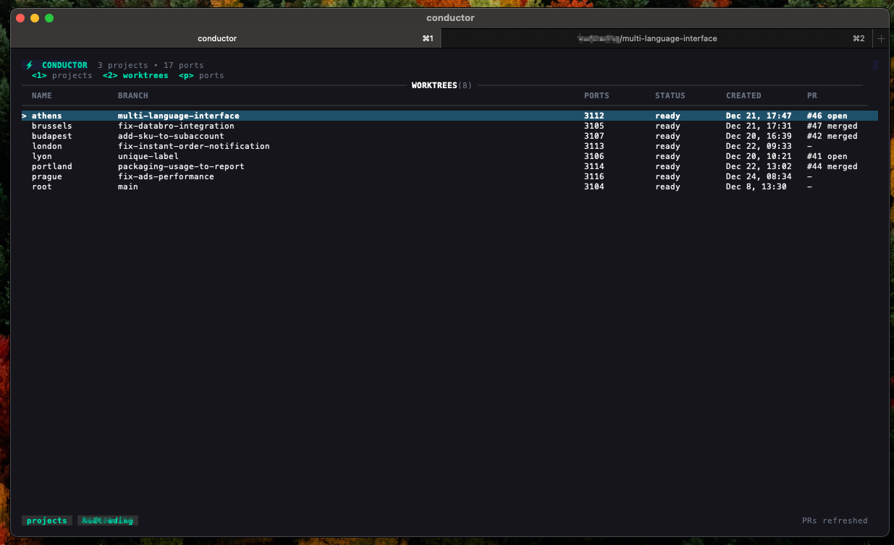

# Conductor

A CLI tool for managing git worktrees across multiple projects with automatic port isolation and environment management.

> **Heavily inspired by [Conductor.build](https://conductor.build/)** - the Mac app for running multiple AI coding agents in isolated workspaces. This CLI brings similar git worktree isolation and management to the command line.



## Why Conductor?

When working on multiple features or bug fixes simultaneously, git worktrees are incredibly useful. However, managing them manually becomes tedious:

- Each worktree needs its own port allocations to avoid conflicts
- Environment variables need to be set up for each workspace
- Setup scripts need to run for dependencies
- Tracking which ports belong to which worktree is error-prone

Conductor solves these problems by:

- **Automatically allocating ports** for each worktree from a configurable range
- **Injecting environment variables** with port and workspace information
- **Running setup/run/archive scripts** automatically
- **Providing a TUI** for easy management of all your projects and worktrees

## Requirements

- **tmux** - Required for the TUI to work
- **git** - For worktree operations
- **gh** (optional) - GitHub CLI for PR integration
- **cloudflared** (optional) - For Cloudflare tunnel support

## Installation

### From Source (Recommended)

```bash
# Clone the repository
git clone https://github.com/KudcraftsHQ/conductor.git
cd conductor

# Build and install to ~/.local/bin (supports auto-updates)
make install
```

This installs `conductor` to `~/.local/bin`, which enables automatic updates without requiring sudo.

**Make sure `~/.local/bin` is in your PATH:**

```bash
# Add to ~/.zshrc or ~/.bashrc
export PATH="$HOME/.local/bin:$PATH"

# Then reload your shell
source ~/.zshrc  # or source ~/.bashrc
```

### Build Options

```bash
make build          # Build for current platform
make build-all      # Build for Linux, macOS, and Windows
make install        # Install to ~/.local/bin (recommended, supports auto-updates)
make install-global # Install to /usr/local/bin (requires sudo, disables auto-updates)
```

### Auto-Updates

Conductor automatically checks for updates on every launch and downloads them in the background. Updates are seamless and require no user intervention.

```bash
# Manually check for updates
conductor update

# Check without installing
conductor update --check

# Disable auto-updates (add to ~/.conductor/conductor.json)
{
  "updates": {
    "autoCheck": false
  }
}
```

**Migrating from System Installation:**

If you previously installed to `/usr/local/bin`, migrate to enable auto-updates:

```bash
conductor migrate
```

## Quick Start

```bash
# Initialize conductor (creates ~/.conductor/)
conductor init

# Add your project
cd /path/to/your/project
conductor project add .

# Create a worktree for a new feature
conductor worktree create feature-auth

# Or launch the interactive TUI
conductor
```

## Usage

### Interactive TUI

Run `conductor` without arguments to launch the interactive terminal UI:

```bash
conductor
```

**Navigation:**
- `↑/↓` or `j/k` - Navigate lists
- `Tab` - Switch between Projects, Worktrees, and Ports views
- `Enter` - Select/Open
- `n` - New worktree
- `c` - Create worktree
- `a` - Archive worktree
- `d` - Delete (with confirmation)
- `o` - Open in terminal
- `t` - Open in terminal
- `C` - Open in Cursor
- `V` - Open in VS Code
- `l` - View logs
- `R` - Retry failed setup
- `m` - View merge requests/PRs
- `w` - Create worktree from PR (in PR view)
- `A` - Auto-setup Claude PRs
- `T` - Toggle tunnel for worktree
- `y` - Copy tunnel URL to clipboard
- `p` - View ports
- `r` - Refresh
- `/` - Filter
- `?` - Help
- `q` - Quit

### CLI Commands

#### Project Management

```bash
# Add current directory as a project
conductor project add .

# Add with custom port count per worktree
conductor project add . --ports 3

# List all projects
conductor project list

# Show project details
conductor project show <project-name>

# Remove a project (doesn't delete files)
conductor project remove <project-name>

# Initialize conductor.json in project
conductor project init
```

#### Worktree Management

```bash
# Create a new worktree (generates random city name)
conductor worktree create

# Create with specific branch name
conductor worktree create feature-auth

# List worktrees for current project
conductor worktree list

# Open worktree in terminal with split panes
conductor worktree open tokyo

# Open in specific IDE
conductor worktree open tokyo --cursor
conductor worktree open tokyo --vscode
conductor worktree open tokyo --zed

# Archive (delete) a worktree
conductor worktree archive tokyo

# Show worktree status
conductor worktree status
```

#### Port Management

```bash
# List all allocated ports
conductor ports list

# Filter by project
conductor ports list --project myproject

# Manually free a port (use with caution)
conductor ports free 3100
```

#### Scripts

```bash
# Run setup script
conductor setup

# Run dev server
conductor run

# Show current worktree status and environment
conductor status
```

#### Cloudflare Tunnels

Expose your local dev server to the internet via Cloudflare tunnels:

```bash
# Quick tunnel (random URL, no setup required)
conductor tunnel start tokyo

# Named tunnel (custom domain)
conductor tunnel start tokyo --named

# Stop a tunnel
conductor tunnel stop tokyo

# List active tunnels
conductor tunnel list

# View tunnel logs
conductor tunnel logs tokyo

# Setup guide
conductor tunnel setup
```

**Quick Tunnels** require no configuration - just start one and get a random `*.trycloudflare.com` URL.

**Named Tunnels** require one-time setup:

```bash
# 1. Install cloudflared
brew install cloudflared

# 2. Login to Cloudflare (opens browser)
cloudflared tunnel login

# 3. Configure your domain in conductor
# Add to ~/.conductor/conductor.json:
{
  "defaults": {
    "tunnel": {
      "domain": "yourdomain.com"
    }
  }
}
```

Named tunnel URLs follow the pattern: `<worktree>-<port>.<domain>` (e.g., `tokyo-3100.yourdomain.com`)

## Configuration

### Global Configuration

Conductor stores its configuration in `~/.conductor/conductor.json`:

```json
{
  "version": 1,
  "defaults": {
    "portsPerWorktree": 1,
    "portRangeStart": 3100,
    "portRangeEnd": 3999,
    "openWith": "iterm",
    "ideCommand": "cursor"
  },
  "portAllocations": {},
  "projects": {}
}
```

### Project Configuration

Create a `conductor.json` in your project root:

```json
{
  "scripts": {
    "setup": "npm install && prisma migrate deploy",
    "run": "npm run dev",
    "archive": "docker-compose down"
  },
  "ports": {
    "default": 3,
    "labels": ["web", "api", "db"]
  }
}
```

Or use external scripts in `.conductor-scripts/`:

```
.conductor-scripts/
├── setup.sh
├── run.sh
└── archive.sh
```

External scripts take precedence over inline scripts.

### Environment Variables

Conductor injects these environment variables when running scripts:

| Variable | Description | Example |
|----------|-------------|---------|
| `CONDUCTOR_PROJECT_NAME` | Project name | `myproject` |
| `CONDUCTOR_WORKSPACE_NAME` | Worktree name | `tokyo` |
| `CONDUCTOR_ROOT_PATH` | Project root path | `/path/to/project` |
| `CONDUCTOR_WORKTREE_PATH` | Worktree path | `~/.conductor/myproject/tokyo` |
| `CONDUCTOR_IS_ROOT` | Is root worktree | `true` or `false` |
| `CONDUCTOR_BRANCH` | Git branch | `feature-auth` |
| `CONDUCTOR_PORT` | Primary port | `3100` |
| `PORT` | Alias for primary port | `3100` |
| `CONDUCTOR_PORT_COUNT` | Number of ports | `3` |
| `CONDUCTOR_PORTS` | All ports (comma-separated) | `3100,3101,3102` |
| `CONDUCTOR_PORT_0` | First port | `3100` |
| `CONDUCTOR_PORT_1` | Second port | `3101` |
| `CONDUCTOR_PORT_WEB` | Labeled port (if configured) | `3100` |
| `CONDUCTOR_TUNNEL_ACTIVE` | Tunnel is active | `true` or `false` |
| `CONDUCTOR_TUNNEL_URL` | Tunnel URL | `https://tokyo-3100.example.com` |
| `CONDUCTOR_TUNNEL_PORT` | Tunneled port | `3100` |
| `CONDUCTOR_TUNNEL_MODE` | Tunnel mode | `quick` or `named` |

## How It Works

### Port Allocation

Conductor allocates consecutive ports from a configurable range (default: 3100-3999):

1. When you create a worktree, Conductor finds the first gap of N consecutive free ports
2. Ports are tracked globally across all projects
3. When a worktree is archived, its ports are freed for reuse

### Worktree Naming

By default, worktrees are named after cities (tokyo, paris, london, etc.) for easy identification. You can also specify a branch name when creating a worktree.

### Directory Structure

```
~/.conductor/
├── conductor.json          # Global configuration
├── myproject/
│   ├── tokyo/              # Worktree directory
│   └── paris/              # Another worktree
└── logs/
    └── myproject/
        ├── tokyo-setup.log
        └── tokyo-archive.log
```

## IDE Integration

Conductor supports opening worktrees in:

- **Cursor** (`--cursor` or `C` in TUI)
- **VS Code** (`--vscode` or `V` in TUI)
- **Zed** (`--zed`)
- **Neovim** (configured via `ideCommand`)

Terminal support:

- **iTerm2** (macOS, with split panes)
- **Terminal.app** (macOS)
- **WezTerm**

## Example Workflow

```bash
# 1. Initialize conductor
conductor init

# 2. Register your project
cd ~/projects/myapp
conductor project add . --ports 2

# 3. Initialize project scripts
conductor project init

# 4. Edit conductor.json with your scripts
# 5. Create a worktree for a feature
conductor worktree create feature-auth
# -> Creates worktree "tokyo" at ~/.conductor/myapp/tokyo
# -> Allocates ports 3100, 3101
# -> Runs setup script

# 6. Open in your IDE
conductor worktree open tokyo --cursor

# 7. Start development
cd ~/.conductor/myapp/tokyo
conductor run
# -> Runs with PORT=3100, CONDUCTOR_PORT_0=3100, CONDUCTOR_PORT_1=3101

# 8. When done, archive the worktree
conductor worktree archive tokyo
# -> Runs archive script
# -> Removes git worktree
# -> Frees ports 3100, 3101
```

## Development

### Requirements

- Go 1.24+

### Building

```bash
make build      # Build binary
make test       # Run tests
make lint       # Run linter (requires golangci-lint)
make fmt        # Format code
```

### Running Tests

```bash
go test ./...

# With coverage
go test -cover ./...
```

## License

MIT

## Contributing

Contributions are welcome! Please feel free to submit a Pull Request.
